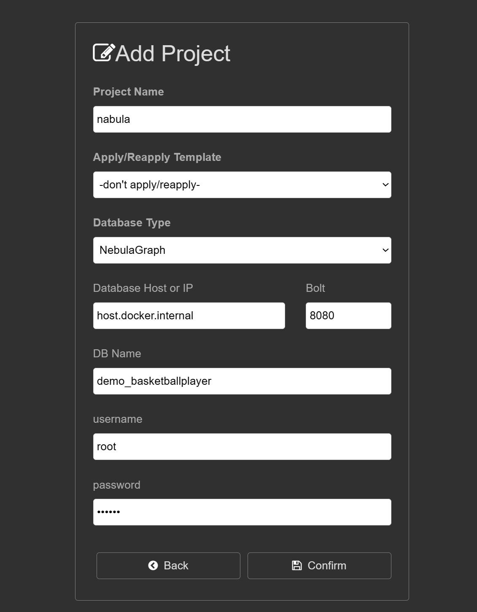

## Nebula Graph 3.6.0 full-text search feature For GraphXR

> Tips: --local_ip=${SERVICE_NAME},  --ws_ip=${SERVICE_NAME} 
> Can't support use 0.0.0.0 replace SERVICE_NAME.
> Maybe later version will support it.

### Start Nebula Graph 3.6.0

```shell
./start-lite.sh
```

### Nebula Graph Studio 

```
Address:  http://localhost:7001   
UserName: root  
Password: nebula  
Host: host.docker.internal  
Port: 9669  
```

Download & Import the dataset in Welcome page.

Click the left logo goto welcome page =>  Scroll down to the `Demos` section => Choose the `demo_basketballplayer`  dataset => Click `Download` button.

 


### Add Project in GraphXR

> You should goto Nebula Graph Studio and create a new graph space named `demo_basketballplayer` and import the data at first.
> We modify a nebula-http-gateway for GraphXR, refer <https://github.com/Kineviz/nebula-http-gateway>

```
Database Type: NebulaGraph  
Database Host: host.docker.internal  
Database Port: 8080  
DB Name: demo_basketballplayer  
Username: root  
Password: nebula  
```  





