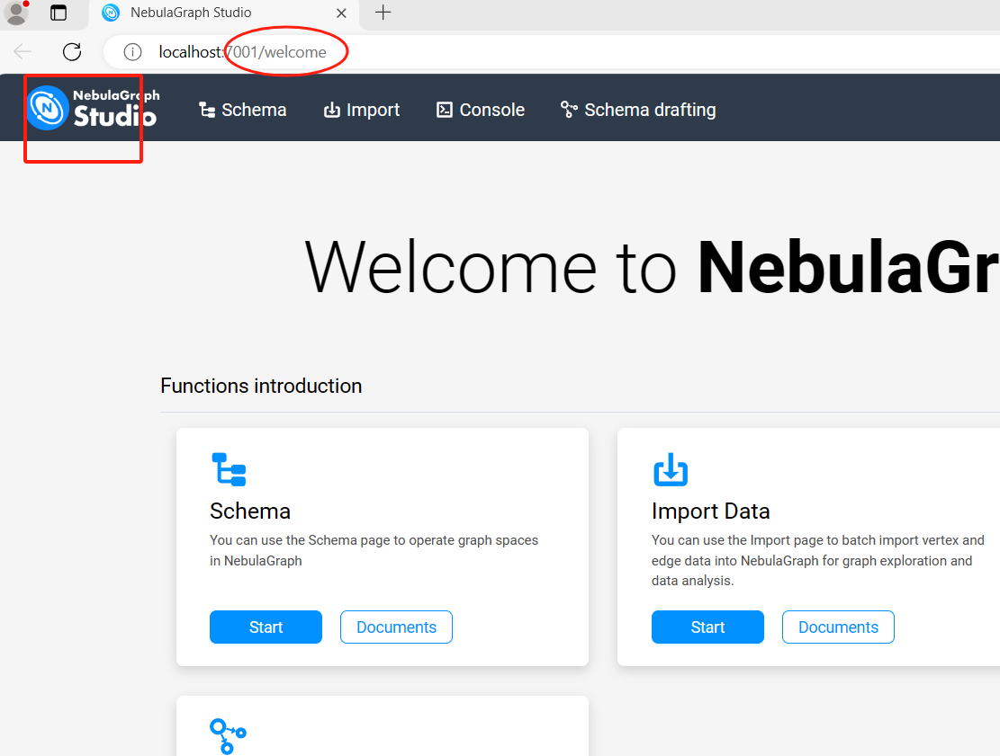

## Nebula Graph full-text search For GraphXR

> Tips: --local_ip=\${SERVICE_NAME},  --ws_ip=\${SERVICE_NAME},
> Can't support use 0.0.0.0 replace SERVICE_NAME.
> Maybe later version will support it.

### Start Nebula Graph 3.6.0

```shell
./start-lite.sh
```

### Nebula Graph Studio 

Address:  <http://localhost:7001> 
```
UserName: root  
Password: nebula  
Host: host.docker.internal  
Port: 9669  
```

Download & Import the dataset in Welcome page.

1) Click the left logo goto welcome page 
2) Scroll down to the `Demos` section 
3) Choose the `demo_basketballplayer`  dataset
4) Click `Download` button.

 


### Add Project in GraphXR

> Kineviz team modify a nebula-http-gateway for GraphXR, refer <https://github.com/Kineviz/nebula-http-gateway>

```
Database Type: NebulaGraph  
Database Host: host.docker.internal  
Database Port: 8080  
DB Name: demo_basketballplayer  
Username: root  
Password: nebula  
```  


### Contact Us

If you want to use the GraphXR with Nebula graph. Please contact us.   


Global: <https://www.kineviz.com/>

China: <https://www.tukegraph.com/>
 
